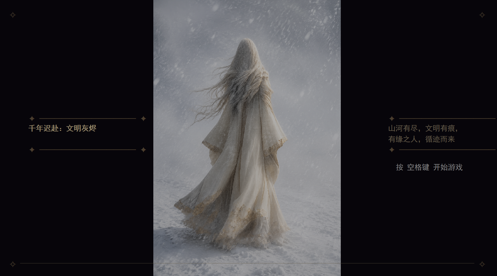
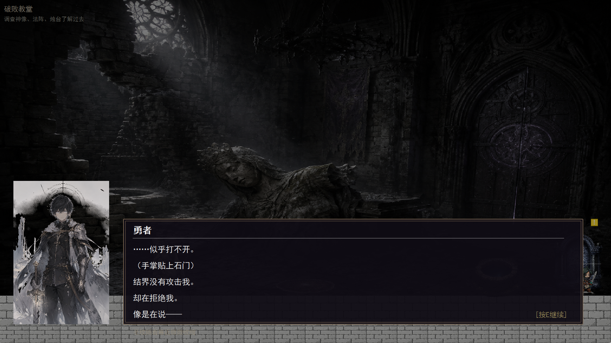
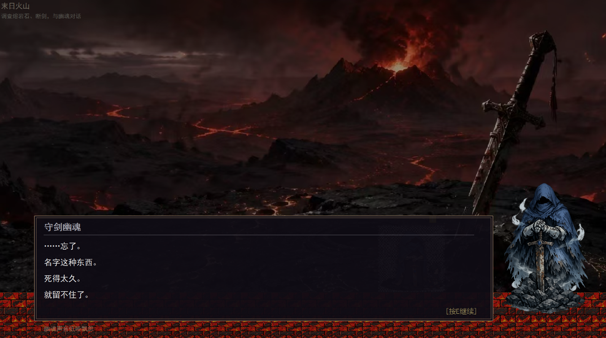
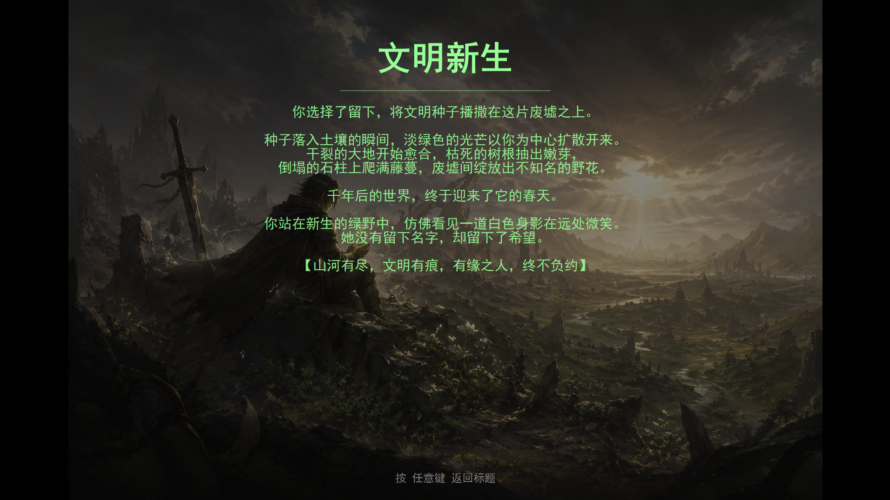
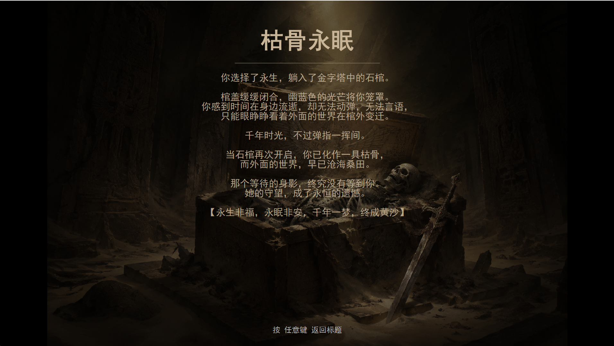

# 千年迟赴：文明灰烬

<p align="center">
  <b>一款基于 Qt 6 开发的 2D 叙事冒险游戏</b><br>
  <i>跨越千年的邀约，无声的守护</i>
</p>

---
## 声明
游戏剧情完全原创，所有图片均由ai生成。如有雷同，算你抄我。 
## 游戏简介

《千年迟赴：文明灰烬》是一款以叙事为核心的 2D 横版冒险游戏。玩家扮演一位被召唤的勇者，降临到千年后的废墟世界。通过独特的"回溯"机制，玩家可以窥见千年前的盛景，逐步揭开一位圣女默默守护文明的隐秘往事。

游戏采用暗线叙事手法，不直接讲述真相，而是通过环境碎片、NPC对话、回溯场景等元素，让玩家自行拼凑出完整的故事。

## 特色功能

- **时空回溯系统** - 调查特定道具触发回溯，窥见千年前的盛景与真相
- **多结局分支** - 5种截然不同的结局，取决于玩家的选择与行动
- **暗线叙事** - 故事隐藏在细节之中，等待玩家自行发掘
- **多场景探索** - 6个精心设计的场景，每个场景都有独特的道具和NPC
- **条件解锁机制** - 特定道具和场景需要完成前置条件才能解锁

## 游戏截图
 
 

 

## 技术栈

- **语言**: C++17
- **框架**: Qt 6 (Qt Widgets)
- **构建系统**: qmake
- **开发环境**: Qt Creator vs2026

## 项目结构

```
LateMillennium/
├── main.cpp              # 程序入口
├── gamewidget.cpp/h      # 游戏主窗口与渲染逻辑
├── player.cpp/h          # 玩家控制与动画
├── scene.cpp/h           # 场景管理与加载
├── npc.cpp/h             # NPC交互逻辑
├── prop.cpp/h            # 道具系统
├── dialogue.cpp/h        # 对话系统
├── ending.cpp/h          # 结局系统
├── resources/            # 游戏资源
│   ├── bg/               # 背景图片
│   ├── prop/             # 道具精灵图
│   ├── npc/              # NPC精灵图
│   └── ...
└── LateMillennium.pro    # Qt项目文件
```

## 游戏操作

| 按键 | 功能 |
|------|------|
| `A` / `←` | 向左移动 |
| `D` / `→` | 向右移动 |
| `W` / `↑` / `Space` | 跳跃 |
| `E` / `Enter` | 交互（与NPC、道具对话） |
| `H` | 显示/隐藏场景提示 |
| `Esc` | 返回/取消 |

## 游戏剧情

### 故事背景

勇者降临在了这片灭亡千年的世界，
他被残留于召唤阵中的力量赐予了"回溯"能力，
能短暂窥见一千年前发生过的场景。
他走过了教堂、地下城、沙漠、火山、图书馆，
他无法改变过去，
只能作为旁观者，
看着文明如何灭亡，
也逐渐意识到：
是有一个人，
在尽力挽救这个世界的同时，
不愿让一个无辜之人被召唤到必死的末日之中，
于是篡改了召唤阵的时间，
让勇者迟到了一千年。

### 场景概览

| 场景 | 描述 | 关键机制 |
|------|------|----------|
| **破败教堂** | 勇者降临之地，毁灭的信仰中心 | 调查法阵、神像、烛台触发回溯；法阵发光后可触发结局 |
| **赛博地下城** | 沉睡千年的地底避难所 | 与龙虾对话解锁幻梦机器；幻梦机器可传送至金字塔或火山 |
| **沙漠金字塔** | 黄沙掩埋的古老王国 | 调查石碑解锁石棺；壁画、石碑、石棺均可触发回溯 |
| **末日火山** | 浩劫的源头，最后的战场 | 与守剑幽魂对话；断剑掉落可拾取 |
| **图书馆秘境** | 封印的知识殿堂 | 调查书架触发时间魔法选项；种子直接触发结局选项 |
| **时空闭环** | 终点即是起点，千年布局的真相 | 调查魔法书触发时间魔法选项；法阵触发结局选项 |

### 关键机制说明

**幻梦机器解锁**
- 需要与地下城的灵智龙虾完成对话
- 解锁后可选择传送到金字塔或火山

**石棺解锁**
- 需要在金字塔调查石碑
- 解锁后可进入石棺触发结局

**法阵发光**
- 调查图书馆的种子后，教堂法阵会发光
- 发光后的法阵可交互触发结局选项

**断剑获取**
- 与火山幽魂完成对话后，断剑掉落
- 拾取断剑后可进入图书馆

### 结局分支

游戏包含 5 种结局，玩家的选择将决定勇者的命运：

| 结局 | 触发条件 | 描述 |
|------|----------|------|
| **文明新生** | 在图书馆种子选择"播撒新生" | 将种子种下，让文明重新萌芽 |
| **逆时赴约** | 在图书馆书架选择"研究时间魔法" | 使用时间魔法回到过去，改变历史 |
| **黄粱一梦** | 在教堂法阵选择"回到原本的世界" | 接受现实，回到原来的世界 |
| **幻梦沉沦** | 在地下城幻梦机器选择"进入幻梦" | 沉溺于虚假的美好，永远沉睡 |
| **枯骨永眠** | 在金字塔石棺选择"躺入石棺" | 陷入永恒的沉眠，与文明一同消逝 |

## 开发者

游戏由个人独立开发，使用 Qt 框架实现。使用ai主要包括ChatGPT-image2（绘图）、豆包（文本转对话和绘图）、trae（写代码）。你问我干了啥？我和ai唠了五天五夜。


---

<p align="center">
  <i>"山河有尽，文明有痕，有缘之人，循迹而来。"</i>
</p>
